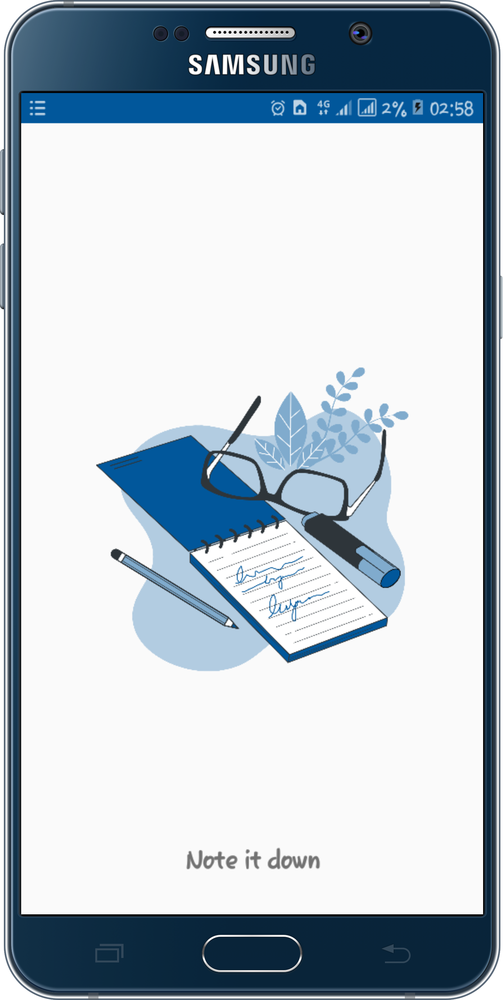
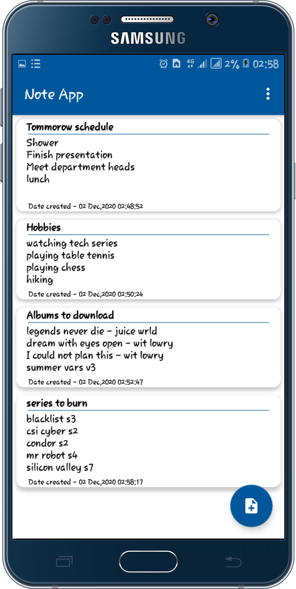
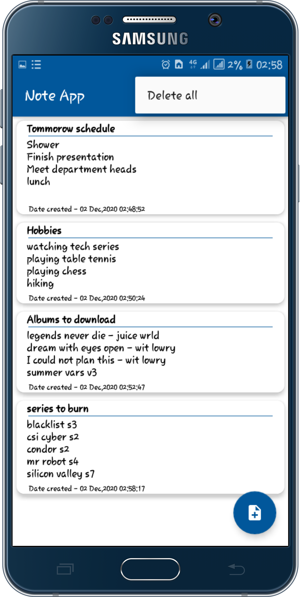
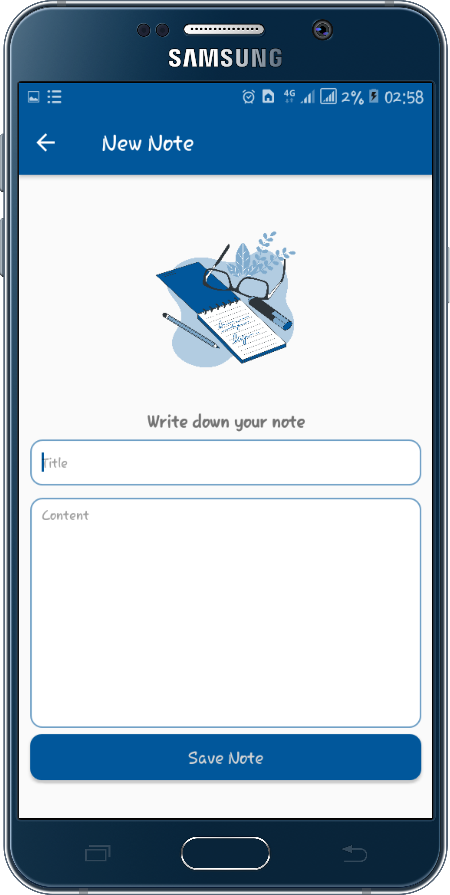

# Note App
MVVM Architecture - Note App
Built with MVVM android architecture component to help one save what he or she is scheduled to do or work on.
Use on option create option menu to delete all notes.
Swipe left or right to delete note.
Use floating button to add note.

Functionality 
<ul>
  <li>Display notes created.</li>
  <li>Add new notes</li>
  <li>Option to delete single note by swiping right or left or deleting all notes using the on option create menu</li>
</ul>
 

## Download App
The link to this app can be downloaded here : <a href ="https://drive.google.com/file/d/1rP1Qun5v4IGtKxQtSIqBsUp5TMDkjCAD/view?usp=sharing">Click here to download</a>
supports devices with min sdk version 15+

## App visual images
### splash screen

### Home
 

### prevention

 

## Tools and Libraries used
<ul>
  <li>This app is written 100% in kotlin</li>
  <li>Android Jetpack components used include</li>
    <ul>
      <li>LiveData - Data observation
      </li>
      <li>
        ViewModel - Handle lifecycle awareness.
      </li>
      <li>
        Room - Offline data persistence.
      </li>
    </ul>
  <li><a href ="https://square.github.io/retrofit/">Retrofit</a> -  retrieving JSON via a REST based webservice.</li>
  <li>Material Design -  Build a nice looking UI.</li>
</ul>
 
  
## Installation
You need a laptop and latest release of android studio(preferred)

## Usage
Clone this project using this link <a href = "https://github.com/MosesWangira/Covid.git">https://github.com/MosesWangira/Covid.git</a> 
Open the project using android studio

